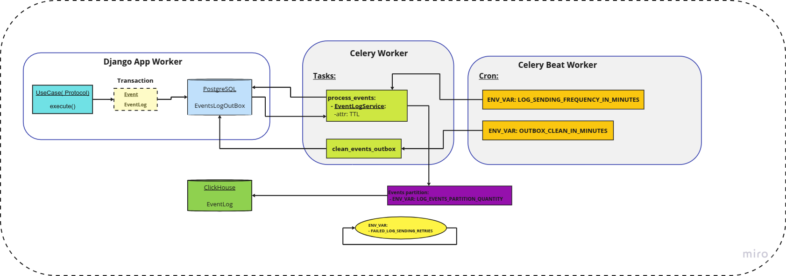

# Workflow creating and storing app server events logs

### Purpose: 
provide transactional event capture along with logging of the event and to provide
efficient delivery of data to the storage. The user UX/UI must be taken into account.

### Implementation:

1. UseCase protocol is extended with the **_log_event method**. 
   Transactional saving of the event and event record is performed by the transactional mechanism of the application's relational db (Postgres)
   Event logging will be stored if the services, using the protocol, have the method **_get_log_event** implemented, 
   acting as an adapter of the event interface into the event log interface.
2. EventLogService is developed, the task of which is to fetch the necessary event log batches and send them to the target storage(ClickHouse).  

   Service workflow:

  - Data sending is performed in batches, selected based on recommendations on the volume of inserted 
    data from ClickHouse(https://clickhouse.com/blog/common-getting-started-issues-with-clickhouse#many-small-inserts).  
    The size of the data batch is set through the **LOG_EVENTS_PARTITION_QUANTITY** environment variable. If there are not yet
    insufficient records in the database, the service instance terminates.
  - When a batch of data is sampled before delivery, the status of the records is set to SENDING. After delivery confirmation, the status for the records
    is switched to DELIVERED status.
  - If a negative response is received from the ClickHouse client or if an exception occurs in the service itself, the status of the send
    data is returned to the original AWAITING DELIVERY.
  - If the next batch of data is unsuccessfully sent, the service try to resend the same batch.
    The number of resend attempts is set via the **FAILED_LOG_SENDING_RETRIES** environment variable
  - Optional parameter **ttl** is provided for initialization of service, which allows to limit the operation time of one service instance,
    which can be useful for work fragmentation and metrics collection.
  - During operation the service accumulates data on successful and unsuccessful attempts to send data
3. The work on sending logs is moved from the main application thread to the background task _Celery_ **process_events**,
   launched using the Celery Beat task scheduler. The frequency of launching is set via
   **LOG_SENDING_FREQUENCY_IN_MINUTES** environment variable and can be adjusted based on the metrics of the amount of incoming data.
4. An additional background task of cleaning outbox storage **clean_events_outbox** is implemented, which runs on a schedule.
   The frequency of data cleaning is determined by the environment variable **OUTBOX_CLEAN_IN_MINUTES**

___
#### Workflow configurations summary:
| ENV_VAR                          | SUGGESTED DEFAULT | COMMENTS                                             |
|----------------------------------|-------------------|------------------------------------------------------|
| LOG_EVENTS_PARTITION_QUANTITY    | 1000              |                                                      | 
| LOG_SENDING_FREQUENCY_IN_MINUTES | 10                |                                                      | 
| OUTBOX_CLEAN_IN_MINUTES          | 1440              | 1 time per day: 60 minutes * 24 hours = 1440 minutes | 
| FAILED_LOG_SENDING_RETRIES       | 5                 |                                                      | 

